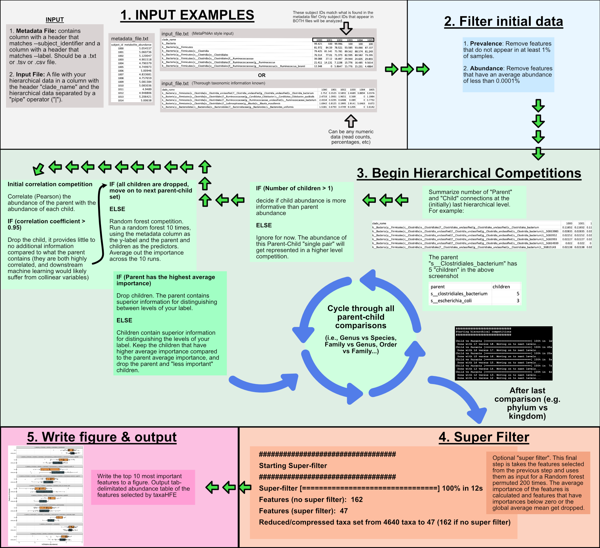

 # **taxaHFE**
 
 (Under active development!)

## Table of Contents
- Download taxaHFE
- Quickstart
- About
- Flag information
- Contribute



## Download taxaHFE

The easiest way to get started is pulling the docker image. Please [install docker](https://www.docker.com/) you go this route. 

```
docker pull aoliver44/nutrition_tools:base_1.7
```

Alternatively, you can pull this image using Singularity:

```
singularity pull aoliver44/nutrition_tools:base_1.7
```
## Quickstart
1. Start the docker image in the directory with your data!
```
docker run --rm -it -v `pwd`:/home/docker -w /home/docker aoliver44/nutrition_tools:base_1.7 bash
```
2. run taxaHFE
```
taxaHFE --subject_identifier subject_id --label cluster [FULL METADATA PATH] [FULL INPUT PATH] [FULL OUTPUT PATH]
```

## Information about the flags

```
Hierarchical feature engineering (HFE) for the reduction of features with respects to a factor or regressor
Usage:
    taxaHFE.R [--subject_identifier=<subject_colname> --label=<label> --feature_type=<feature_type> --input_covariates=<path> --subsample=<decimal> --format_metaphlan=<format> --cor_level=<correlation_level> --write_old_files=<TRUE/FALSE> --ncores=<ncores>] <input_metadata> <input> <output>

Options:
    -h --help  Show this screen.
    -v --version  Show version.
    --subject_identifier name of columns with subject IDs [default: subject_id]
    --label response feature of interest for classification [default: cluster]
    --feature_type of response i.e. numeric or factor [default: factor]
    --input_covariates path to input covariates [default: FALSE]
    --subsample decimal, only let random forests see a fraction of total data [default: 1]
    --format_metaphlan tells program to expect the desired hData style format, otherwise it attempts to coerce into format [default: FALSE]
    --cor_level level of initial correlation filter [default: 0.95]
    --write_old_files write individual level files and old HFE files [default: TRUE]
    --ncores number of cpu cores to use [default: 2]
Arguments:
    input_meta path to metadata input (txt | tsv | csv)
    input path to input file from hierarchical data (i.e. hData data) (txt | tsv | csv)
    output output file name (txt)

```

--subject_identifier: this is a column that identifies the sample or subject ID. All subjectIDs should be unique.

--label: the name of the column in your input dataset that you are trying to predict with HFE. Can be a factor or continous.

--feature_type: is the label a factor or a continous variable?

--format_metaphlan: is the format of the input file in the "MetaPhlAn" style? What this looks like is (from their tutorial):

```
clade_name	1000	1001	1002	1003	1004	1005
k__Bacteria	99.42133	100	99.99635	100	100	100
k__Bacteria|p__Firmicutes	81.9719	84.5898	78.52073	93.58543	93.06581	87.13719
k__Bacteria|p__Firmicutes|c__Clostridia	79.42476	81.14081	75.78129	89.56234	88.57445	81.24939
k__Bacteria|p__Firmicutes|c__Clostridia|o__Clostridiales	76.51425	77.01005	71.37259	82.59526	80.58246	73.2948
k__Bacteria|p__Firmicutes|c__Clostridia|o__Clostridiales|f__Ruminococcaceae	39.08761	27.1199	18.49715	29.94427	24.60523	29.85498
k__Bacteria|p__Firmicutes|c__Clostridia|o__Clostridiales|f__Ruminococcaceae|g__Ruminococcus	21.41056	14.13104	7.11984	15.77574	16.48518	9.5614
k__Bacteria|p__Firmicutes|c__Clostridia|o__Clostridiales|f__Ruminococcaceae|g__Ruminococcus|s__Ruminococcus_bromii	12.34825	0	5.86474	15.77574	15.23062	4.48636
```

Notice that each taxonomic level is summarized on its own line, and the columns are the samples assessed. **Importantly, taxaHFE needs the column with the taxonomic (hierarchical) information in a column with the header clade_name.** If ```--format_metaphlan FALSE```, the program will try and summarize each level, and coerce the input file into a "MetaPhlAn" style input. Fair warning, if your input taxonomic file has a lot of missing levels (i.e., k__Bacteria|p__Firmicutes|c__Clostridia|o__Clostridiales|f__|g__|s__Clostridiales_sp_OTU12345), they will get summarized to the last known level. Using the previous example, the empty genus and family level will be summarized to f__Clostridiales_unclassified and g__Clostridiales_unclassified. The downside to this method is that, pontentially very different taxa can get grouped together in a _unclassifed level. Taxonomic assignment has come a long way! Try to use a method that results in the most complete information.
input_meta: the file that contains the metadata column you wish to predict with your hierarchical data. This file should contain BOTH your subject_identifier and your metadata label

input: your taxonomic or hierarchical feature set. Columns should be your subject_identifier, plus one column labeled clade_name.

**OUTPUTS**

## About
We developed software, called taxaHFE (Hierarchical Feature Engineering), which works by first considering the pairwise correlation structure between a taxon and its descendants to prune descendants above a correlation threshold. Next it permutes a random forest on the taxon and remaining descendants to determine how important each is at explaining an intervention or clinical covariate. If, on average, the taxon is the most important feature in the model, the descendants are dropped, otherwise only the descendants more important than the taxon are kept. Last, an optional final filter step considers all features remaining, and again permutes a random forest. Any features which are either below the average importance of all remaining features or have a negative or zero average importance are dropped.  

## Contribute

Feel free to raise in issue, contribute with a pull request, or reach out!


