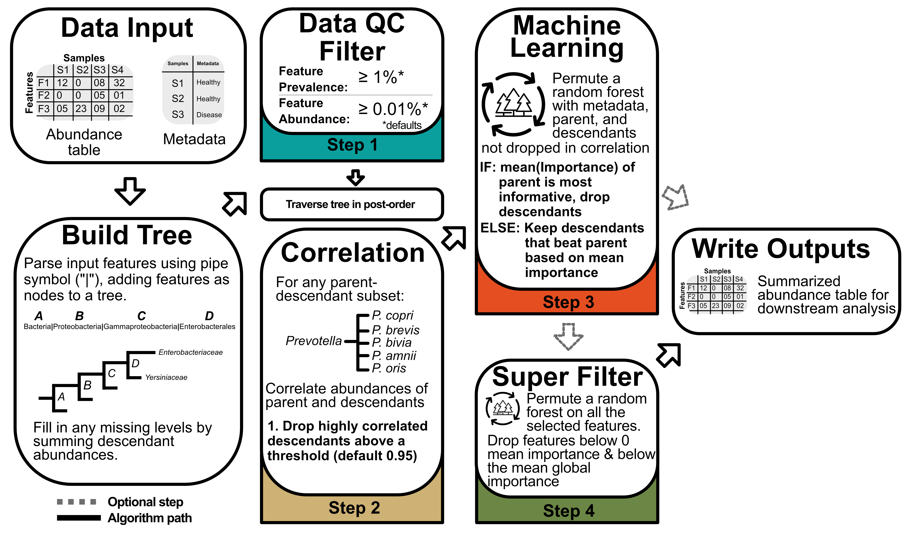
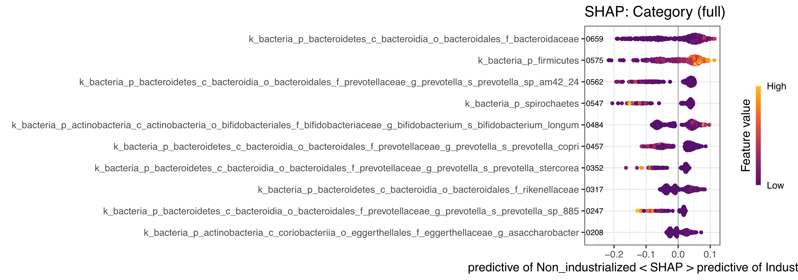

# **TaxaHFE & TaxaHFE-ML** <a></a>
```taxaHFE``` is a program for performing hierarchical feature engineering on data with a taxonomic organization (e.g., microbiome data, dietary data). ```taxaHFE-ML``` is a variation of ```taxaHFE``` that performs hierarchical feature engineering on training and test datasets, then assesses feature performance using a random forest applied to the hierarchically engineered outputs. If your goal is to reduce a set of hierarchically organized features, use ```taxaHFE```. If your goal is to use hierarchically organized features in machine learning models, we recommend using ```taxaHFE-ML```.

## **Table of Contents**
- [Background on the algorithm](#background-on-the-algorithm)
- [Installing taxaHFE](#installing-taxahfe)
- [Example: Gut Microbiome, Industrial vs. Non-Industrial](#example-1-exploring-differences-in-the-gut-microbiome-of-individuals-living-in-industrialized-vs-non-industrialized-communities)
- [Flag information](#information-about-the-flags)
- [Troubleshooting](#troubleshooting)
- [FAQ](#faq)
- [Acknowledgments](#acknowledgments)
- [Contribute](#contribute)
- [Citation](#citation)


 ## **Background on the algorithm** 
A program to perform hierarchical feature engineering on data with a taxonomic organization (e.g., microbiome data, dietary data). This is not a new idea; however, few implementations exist in the wild. For background reading on these concepts, please see the links below:

- [TaxaHFE: A machine learning approach to collapse microbiome datasets using taxonomic structure.](https://doi.org/10.1093/bioadv/vbad165)
Andrew Oliver, Matthew Kay, Danielle G. Lemay. 2023. *Bioinformatics Advances*. 

- [Taxonomy-aware feature engineering for microbiome classification.](https://bmcbioinformatics.biomedcentral.com/articles/10.1186/s12859-018-2205-3)
Mai Oudah & Andreas Henschel. 2018. *BMC Bioinformatics*.

- [Feature Selection in Hierarchical Feature Spaces.](https://link.springer.com/chapter/10.1007/978-3-319-11812-3_25)
Petar Ristoski & Heiko Paulheim. 2014. *International Conference on Discovery Science*.

### **Graphical outline of taxaHFE**



```taxaHFE ```(Hierarchical Feature Engineering) begins by evaluating the pairwise correlation structure between a parent taxon’s abundance and that of its descendants to prune descendants that exceed a specified correlation threshold. For parent-child taxa not collapsed in the correlation step, ```taxaHFE``` then uses a permutation-based random forest to assess the importance of the parent taxon and its remaining descendants in explaining a response of interest. If the parent taxon is, on average, the most important feature, all descendants are dropped. Otherwise, only the descendants with higher importance than the parent are retained.

Finally, an optional filter step considers all remaining features and applies another permutation-based random forest. Features with average importance below the overall mean, or with negative or zero importance, are dropped.
</br>

## **Installing taxaHFE**

```taxaHFE``` is a containerized application and can be run in the following ways:

<details>
<summary> <b>Option 1:</b> The easiest way to get started is by pulling the Docker image. This is a good option if you are on your own machine and have permission to install software.
</summary>

Please [install docker](https://www.docker.com/) if you choose this route. Pulling these containers for the first time may take a few minutes to run, so please be patient. 

*Additionally, if this is your first time using Docker, you may need to configure the program to allow it to use the appropriate compute resources (i.e., ram, CPUs, etc.).*
```
## pull taxaHFE
docker pull aoliver44/taxa_hfe:latest

## pull taxaHFE-ML
docker pull aoliver44/taxa_hfe_ml:latest
```
</details>
</br>
<details>
<summary> <b>Option 2:</b> Alternatively, you can pull this image using Singularity or Apptainer. This is a good option if you are on a managed HPC environment.
</summary>
Note that currently running the below commands using Apptainer will still work, as Apptainer has not superseded Singularity.

```
## pull taxaHFE
singularity pull taxaHFE.sif docker://aoliver44/taxa_hfe:latest

## pull taxaHFE-ML
singularity pull taxaHFE_ML.sif docker://aoliver44/taxa_hfe_ml:latest
```
</details>
</br>


<details>
<summary> <i>A note on using Docker on Windows</i> </summary> 

```taxaHFE``` can run on Windows through [Powershell](https://aka.ms/PSWindows) and [Docker Desktop for Windows](https://docs.docker.com/desktop/install/windows-install/). In order for the program to run smoothly, several adjustments are recommended beforehand:

 1) **Prepare wsl (Windows Subsystem for Linux)**

    In Powershell, set the default wsl to Ubuntu. The default will only need to be set once, but wsl will need to be turned on with every ```taxaHFE``` run. 
    
    *Note*: Error without setting default, "VS Code Server for WSL closed unexpectedly"

```  
## Powershell       
## change default wsl to Ubuntu
wsl --set-default Ubuntu 

## turn on wsl
wsl                      
```

2) **Enable Ubuntu in Docker Desktop App**

    *Note*: Error without setting adjustment, Directory files do not read in when docker is initiated

-   Settings \> Resources \> WSL Integration \> Enable Ubuntu

</details>

------------------------------
## **Example 1: Exploring differences in the gut microbiome of individuals living in industrialized vs non-industrialized communities**

This example is included in the repository for several reasons. First, it’s a dataset we use to test ```taxaHFE``` (and ```taxaHFE-ML```) as we continue to develop the program and implement enhancements to improve the user experience. Second, it provides users with a reference set of files to compare their own inputs against—these files are in the correct format! Lastly, they’re just cool samples from work one of the developers did during grad school.


**Step 1:** Clone the repository or download the example data files in the [example_inputs/](https://github.com/aoliver44/taxaHFE/tree/main/example_inputs) directory on GitHub

```
## clone the repository
git clone https://github.com/aoliver44/taxaHFE.git && cd taxaHFE/
```

**Step 2:**  Run ```taxaHFE-ML``` using the example files and default parameters. This command will work with the example data. If it doesn't, check out our troubleshooting tips below (do you have Docker running?), or consider opening an issue on GitHub. 

> [!CAUTION] 
> Setting container-level resources is by far the most reliable way (in our experience) to ensure that ```taxaHFE``` uses the appropriate system resources. If you set ```--ncores 2``` without also specifying ```--cpus=2``` in the Docker command (or the equivalent flag in Apptainer), some processes within ```taxaHFE``` and ```taxaHFE-ML``` may exceed the intended resource limits. </br> </br> Setting ```--ncores 1``` will instruct ```taxaHFE``` to limit resource usage as best it can, but this is not foolproof. The main situation where excessive core usage becomes an issue is when the ```--shap``` flag is used. To avoid this, we strongly recommend setting CPU and memory limits directly in the ```docker run``` command. Adjust the values to suit the capabilities of your machine.

```
docker run --cpus=2 --memory=4g --platform linux/amd64 --rm -it -v `pwd`:/data aoliver44/taxa_hfe_ml:latest example_inputs/metadata.txt example_inputs/microbiome_data.txt -o test_outputs -s Sample -l Category --seed 1234 --shap -n 2
```

Using the default of 2 cores on a MacBook Pro with an M3 chip, the above command took approximately 8 minutes and 21 seconds to complete. RAM usage peaked at around 1.4 GB. Increasing resources to 8 cpus (```--cups=8``` *and* ```--ncores 8```), and ```--memory=8g``` cut that runtime significantly (runtime = 3 minutes and 12 seconds). The input data included 288 samples and 1,187 MetaPhlAn-generated taxonomic features. We put in some effort to provide progress bars so you know something is happening. In some situations—especially certain computer or HPC environments—these progress bars may not show up. Bummer.

**Step 3:** Examine the outputs. Several outputs get generated from the command run in the previous step:

```
├── test_outputs
│   ├── ml_analysis
│   │   ├── dummy_model_results.csv
│   │   ├── ml_results.csv
│   │   ├── shap_inputs_taxa_hfe_ml_sf_1234.RData
│   │   ├── shap_taxa_hfe_ml_sf_1234_full.pdf
│   │   ├── shap_taxa_hfe_ml_sf_1234_test.pdf
│   │   └── shap_taxa_hfe_ml_sf_1234_train.pdf
│   ├── taxa_hfe_ml_sf_test_NA.csv
│   └── taxa_hfe_ml_sf_train_NA.csv
```

The file names are written to be somewhat informative. For example, ```taxa_hfe_ml_sf_train_NA.csv``` is the post-HFE, feature-reduced training set that was input to the downstream ML pipeline. The "sf" in the filename indicates that the "super filter" was applied (see default flag arguments for more details).

After the run is complete, a directory called ```ml_analysis/``` is created, where the machine learning results for both the trained and dummy models are stored. Additionally, SHAP plots are generated to illustrate the top features driving the ML model. The "1234" in the SHAP plot filenames refers to the random seed used for that run.

For a great overview of SHAP analyses and how to interpret these plots, check out [this guide](https://www.aidancooper.co.uk/a-non-technical-guide-to-interpreting-shap-analyses/).

### Examining the results
<details>
<summary> 
1) Lets look at: ./test_outputs/ml_analysis/ml_results.csv
</summary>

| metric       | estimator | estimate | config               | null_model_avg      | seed | program        |
|--------------|-----------|----------|----------------------|---------------------|------|----------------|
| accuracy     | binary    | 1        | Preprocessor1_Model1 | 0.6785714285714286  | 1234 | taxa_hfe_ml_sf |
| bal_accuracy | binary    | 1        | Preprocessor1_Model1 | 0.5                 | 1234 | taxa_hfe_ml_sf |
| f_meas       | binary    | 1        | Preprocessor1_Model1 | 0.8085106382978724  | 1234 | taxa_hfe_ml_sf |
| kap          | binary    | 1        | Preprocessor1_Model1 | NA                  | 1234 | taxa_hfe_ml_sf |
| roc_auc      | binary    | 1        | Preprocessor1_Model1 | NA                  | 1234 | taxa_hfe_ml_sf |

Here we see the performance of the ```taxaHFE```-engineered microbiome features in predicting whether an individual resides in an industrialized or non-industrialized area. For example, a naïve model would be correct about 68% of the time (see the 'null_model_avg' for accuracy) in predicting industrialized vs. non-industrialized status (this model has no real skill—it simply predicts the majority class, and note there is some class imbalance). In contrast, the trained model is correct 100% of the time (see 'estimate' for accuracy)!
</details>
</br>
<details>
<summary> 
2) Lets next look at: ./test_outputs/ml_analysis/shap_taxa_hfe_ml_sf_1234_full.pdf
</summary>

The below figure shows the ```taxaHFE```-selected features that driving the ML model predictions:



> First, take note in the above figure of the hierarchical feature engineering that occured! For example, all the species in the phylum *Firmicutes* has now been collapsed to the phylum level. However, different species of *Prevotella* remain!

```taxaHFE-ML``` will plot the top 10 most important features, determined by a SHAP analysis, using a beeswarm plot.  For example, in the above plot, note that higher abundances of *Firmicutes* were more predictive of industrialized gut microbiomes.
</details>


## **Information about the flags**

</details>

<details>
<summary> <b>taxaHFE flags:</b> 
</summary>

```
usage: taxa_hfe [options] METADATA DATA

Hierarchical feature engineering (HFE) for feature reduction

positional arguments:
  METADATA              path to metadata input (txt | tsv | csv)
  DATA                  path to input file from hierarchical data (i.e. hData data) (txt | tsv | csv)

options:
  -h, --help            show this help message and exit
  -o <string>, --output_dir <string>
                        Directory for the output files to be written. Defaults to a directory called 'outputs' (default: outputs)
  -v, --version         show program's version number and exit
  --data_dir <string>   Directory for MEATDATA, DATA, and output_dir, ignored if using absolute paths. Defaults to the current directory (default: .)
  --seed <numeric>      Set the seed, if no value is provided, uses a random number from the range (-1 * 2^31, 2^31 - 1) (default: 313045552)

TaxaHFE arguments:
  Options to pass to TaxaHFE

  -s <string>, --subject_identifier <string>
                        Metadata column name containing subject IDs (default: subject_id)
  -l <string>, --label <string>
                        Metadata column name of interest for ML (default: feature_of_interest)
  -t <string>, --feature_type <string>
                        Is the ML label a factor or numeric (default: factor)
  -R, --random_effects  Consider repeated measures. Note: columns 'individual' and 'time' must be present. [BETA] (default: False)
  -k <numeric>, --k_splits <numeric>
                        We use kmeans to factorize a numeric response for repeated measures. How many categories should we create? [BETA] (default: 3)
  -a <numeric>, --abundance <numeric>
                        Minimum mean abundance of feature (default: 0)
  -p <numeric>, --prevalence <numeric>
                        Minimum prevalence of feature (default: 0.01)
  -L <numeric>, --lowest_level <numeric>
                        Most general level allowed to compete (default: 3)
  -m <numeric>, --max_level <numeric>
                        How many hierarchical levels should be allowed to compete (default: 15)
  -c <numeric>, --cor_level <numeric>
                        Initial pearson correlation filter (default: 0.95)
  -d, --disable_super_filter
                        Disable running of the super filter (final forest competition) (default: False)
  -w, --write_old_files
                        Write individual level files and old HFE files (default: False)
  -W, --write_flattened_tree
                        Write a compressed backup of the entire competed tree (default: False)
  -D, --write_both_outputs
                        Write an output for pre and post super filter results, overridden by --disable_super_filter (default: False)
  --nperm <numeric>     Number of taxaHFE RF permutations (default: 40)
  -n <numeric>, --ncores <numeric>
                        Number of parallel processes to run in certain portions of taxaHFE that support parallel processing. To limit overall resource usage of taxaHFE, limit the amount of resources available to the container (e.g. --cpus=4 for Docker) (default: 2)
```
</details>
</br>

<details>
<summary> <b>taxaHFE-ML flags:</b> 
</summary>

```
usage: taxa_hfe [options] METADATA DATA

Hierarchical feature engineering (HFE) for feature reduction

positional arguments:
  METADATA              path to metadata input (txt | tsv | csv)
  DATA                  path to input file from hierarchical data (i.e. hData data) (txt | tsv | csv)

options:
  -h, --help            show this help message and exit
  -o <string>, --output_dir <string>
                        Directory for the output files to be written. Defaults to a directory called 'outputs' (default: outputs)
  -v, --version         show program's version number and exit
  --data_dir <string>   Directory for MEATDATA, DATA, and output_dir, ignored if using absolute paths. Defaults to the current directory (default: .)
  --seed <numeric>      Set the seed, if no value is provided, uses a random number from the range (-1 * 2^31, 2^31 - 1) (default: 313045552)

TaxaHFE arguments:
  Options to pass to TaxaHFE

  -s <string>, --subject_identifier <string>
                        Metadata column name containing subject IDs (default: subject_id)
  -l <string>, --label <string>
                        Metadata column name of interest for ML (default: feature_of_interest)
  -t <string>, --feature_type <string>
                        Is the ML label a factor or numeric (default: factor)
  -R, --random_effects  Consider repeated measures. Note: columns 'individual' and 'time' must be present. [BETA] (default: False)
  -k <numeric>, --k_splits <numeric>
                        We use kmeans to factorize a numeric response for repeated measures. How many categories should we create? [BETA] (default: 3)
  -a <numeric>, --abundance <numeric>
                        Minimum mean abundance of feature (default: 0)
  -p <numeric>, --prevalence <numeric>
                        Minimum prevalence of feature (default: 0.01)
  -L <numeric>, --lowest_level <numeric>
                        Most general level allowed to compete (default: 3)
  -m <numeric>, --max_level <numeric>
                        How many hierarchical levels should be allowed to compete (default: 15)
  -c <numeric>, --cor_level <numeric>
                        Initial pearson correlation filter (default: 0.95)
  -d, --disable_super_filter
                        Disable running of the super filter (final forest competition) (default: False)
  -w, --write_old_files
                        Write individual level files and old HFE files (default: False)
  -W, --write_flattened_tree
                        Write a compressed backup of the entire competed tree (default: False)
  -D, --write_both_outputs
                        Write an output for pre and post super filter results, overridden by --disable_super_filter (default: False)
  --nperm <numeric>     Number of taxaHFE RF permutations (default: 40)
  -n <numeric>, --ncores <numeric>
                        Number of parallel processes to run in certain portions of taxaHFE that support parallel processing. To limit overall resource usage of taxaHFE, limit the amount of resources available to the container (e.g. --cpus=4 for Docker) (default: 2)
Andrews-MacBook-Pro-2:taxaHFE andrewoliver$ docker run --cpus=8 --memory=8g --platform linux/amd64 --rm -it -v `pwd`:/data aoliver44/taxa_hfe_ml:dev -h
usage: taxa_hfe_ml [options] METADATA DATA

Hierarchical feature engineering (HFE) with ML

positional arguments:
  METADATA              path to metadata input (txt | tsv | csv)
  DATA                  path to input file from hierarchical data (i.e. hData data) (txt | tsv | csv)

options:
  -h, --help            show this help message and exit
  -o <string>, --output_dir <string>
                        Directory for the output files to be written. Defaults to a directory called 'outputs' (default: outputs)
  -v, --version         show program's version number and exit
  --data_dir <string>   Directory for MEATDATA, DATA, and output_dir, ignored if using absolute paths. Defaults to the current directory (default: .)
  --seed <numeric>      Set the seed, if no value is provided, uses a random number from the range (-1 * 2^31, 2^31 - 1) (default: -450524883)

TaxaHFE arguments:
  Options to pass to TaxaHFE

  -s <string>, --subject_identifier <string>
                        Metadata column name containing subject IDs (default: subject_id)
  -l <string>, --label <string>
                        Metadata column name of interest for ML (default: feature_of_interest)
  -t <string>, --feature_type <string>
                        Is the ML label a factor or numeric (default: factor)
  -R, --random_effects  Consider repeated measures. Note: columns 'individual' and 'time' must be present. [BETA] (default: False)
  -k <numeric>, --k_splits <numeric>
                        We use kmeans to factorize a numeric response for repeated measures. How many categories should we create? [BETA] (default: 3)
  -a <numeric>, --abundance <numeric>
                        Minimum mean abundance of feature (default: 0)
  -p <numeric>, --prevalence <numeric>
                        Minimum prevalence of feature (default: 0.01)
  -L <numeric>, --lowest_level <numeric>
                        Most general level allowed to compete (default: 3)
  -m <numeric>, --max_level <numeric>
                        How many hierarchical levels should be allowed to compete (default: 15)
  -c <numeric>, --cor_level <numeric>
                        Initial pearson correlation filter (default: 0.95)
  -d, --disable_super_filter
                        Disable running of the super filter (final forest competition) (default: False)
  -w, --write_old_files
                        Write individual level files and old HFE files (default: False)
  -W, --write_flattened_tree
                        Write a compressed backup of the entire competed tree (default: False)
  -D, --write_both_outputs
                        Write an output for pre and post super filter results, overridden by --disable_super_filter (default: False)
  --nperm <numeric>     Number of taxaHFE RF permutations (default: 40)
  -n <numeric>, --ncores <numeric>
                        Number of parallel processes to run in certain portions of taxaHFE that support parallel processing. To limit overall resource usage of taxaHFE, limit the amount of resources available to the container (e.g. --cpus=4 for Docker) (default: 2)

TaxaHFE-ML specific arguments:
  Options to pass to TaxaHFE-ML for machine learning and SHAP analysis of TaxaHFE features

  --train_split <numeric>
                        Percentage of samples to use for training (default: 0.8)
  --model <string>      ML model to use (default: rf)
  --folds <numeric>     Number of CV folds for tuning (default: 10)
  --metric <string>     Metric to optimize (default: bal_accuracy)
  --tune_length <numeric>
                        Number of hyperparameter combinations to sample (default: 80)
  --tune_time <numeric>
                        Time for hyperparameter search (in minutes) (default: 2)
  --tune_stop <numeric>
                        Number of HP iterations without improvement before stopping (default: 10)
  --permute <numeric>   Number of times to permute the ML assessment process, resulting in n different test/train split inputs (default: 1)
  --shap                Calculate SHAP values (default: False)
  --summarized_levels   Include summarized levels in ML competition (default: False)
```
</details>
</br>

<details>
<summary> <b>Additional details about the flags</b> 
</summary> 

Below are some some additional details about certain flags.

```--subject_identifier```: Specifies the column in the input metadata that identifies each sample or subject ID. All subject IDs should be unique. They will be coerced to unique, simplified snake_case alphanumeric values using ```janitor::make_clean_names()```.

```--abundance```: A per-feature abundance filter. If your sampling effort is not standardized (e.g., not expressed as relative abundance), this filter may behave unpredictably. The default is ```0```, meaning no features are filtered out as long as the minimum abundance is ```0```.

```--prevalence```: A per-feature prevalence filter that controls how many non-zero occurrences are required for a feature to be retained. By default, features with 99% zeros are dropped from analysis. This filter is somewhat sensitive to sampling depth—samples with greater sequencing depth may detect more rare features.

```--lowest_level```: Specifies the lowest taxonomic level at which ```taxaHFE``` should run its feature competitions. In microbiome datasets, features often span taxonomic levels from general to specific (e.g., kingdom → phylum → class → order → family → genus → species). ```taxaHFE``` adds one extra level above kingdom called taxa_tree, representing the total abundance per sample.

- Setting ```--lowest_level 1``` allows competitions down to taxa_tree, meaning it could be selected as the sole informative feature (e.g., if total abundance best explains your metadata label).

- Setting ```--lowest_level 2```, stopping at the kingdom level (e.g., if the abundance of k_Archaea was the most informative feature)

- The default value, ```--lowest_level 3```, is if you're specifically interested in what features are informative within general groupings (e.g., which bacteria, archaea, etc.). 

- Setting this flag higher will stop the competitions earlier (e.g., ```--lowest_level 4``` will stop at the 'class' level)

```--max_level```: Controls how far away from the root to consider the first set of children to compete. The default is ```--max_level 15```, allowing a child feature which is up to 15 levels away from the root to compete. 

- Setting this flag to ```--max_level 5``` means that, in a microbiome example, ```taxaHFE``` will at most choose taxa at the order level, but never at the genus, family, species, etc.

```--ncores```: Once again, we highly recommend you set the container resources (e.g., ```docker run --cpus=2```), to match whatever you set with ```--ncores```.

```--seed```: the default behavior is to generate a random seed each time ```taxaHFE``` is run, between the minimum and maximum values of machine precision for the R language (-2e31 - 2e31). If you set it to a number, it will likely return the same results across repeated runs (assuming you are on the same machine).

</details>

## Troubleshooting

**Problem #1:** I'm getting the error:
```
docker: Cannot connect to the Docker daemon at unix:///Users/.docker/run/docker.sock. Is the docker daemon running?
```

<details>
<summary> <b>Fix #1:</b> 
</summary>
Make sure the Docker application is running! If you can't run ```docker image list``` in your terminal, the Docker application has not been started!
</details>

</br>

**Problem #2:** Docker is running but I immediately get this error:

```
usage: taxa_hfe_ml [options] METADATA DATA
taxa_hfe_ml.R: error: unrecognized arguments:
```

<details>
<summary> <b>Fix #2:</b> 
</summary>
Double check all the flags for spelling issues! For example, if you specified ```-seed``` instead of ```--seed``` (note number of dashes!), the program will error.
</details>

</br>

**Problem #3:** I get a terminal message like this:

```
Error in `check_time()`:
! The time limit of 0.2 minutes has been reached.
Backtrace:
     x
  1. +-global run_diet_ml(...)
  2. | \-global pass_to_dietML(...)
  3. |   \-global run_dietML_ranger(...)
  4. |     \-diet_ml_wflow %>% ...
  5. +-tune::tune_bayes(...)
  6. \-tune:::tune_bayes.workflow(...)
  7.   \-tune:::tune_bayes_workflow(...)
  8.     \-(function() {...
  9.       \-tune::check_time(start_time, control$time_limit)
 10.         \-rlang::abort(paste("The time limit of", limit, "minutes has been reached."))
x Optimization stopped prematurely; returning current results.
```
or
```
! No improvement for 10 iterations; returning current results.
```
<details>
<summary> <b>Fix #3:</b> 
</summary>
No fix needed! These are just messages from the ```Tidymodels``` package informing you on the hyperparameter tuning steps.
</details>

</br>

**Problem #4:** After building and competing the tree, I get the error: 

```
Error in `check_outcome()`:
! For a classification model, the outcome should be a `factor`, not a `numeric`.
```
<details>
<summary> <b>Fix #4:</b> 
</summary>
If your outcome factor is encoded as 0 and 1 the downstream ML will break. Please encode it as "high" or "low" for example.
</details>

</br>

**Problem #5:** This is taking FOREVER!

<details>
<summary> <b>Fix #5:</b> 
</summary>
Welp, it might still be working, in which case, "Okay!! We get it!! You have a ton of samples!!". More seriously, larger files may take a ton of time to read in, especially for the metadata file. If you have a lot of levels to compete, this could take time too. Consider giving it more resources. If it is still giving you trouble, let us know about it by opening an issue. 
</details>

**Problem #6:** I see this message when running SHAP analysis

```
SHAP analysis encountered an issue and all output files may not have been generated
```

<details>
<summary> <b>Fix #6:</b> 
</summary>
Occasionally SHAP errors out, expecially when sample sizes are limited. Because we initially write the full SHAP file first (PDF contains `_full`), which is the SHAP analysis run using all of the samples, check first to see if the full SHAP PDF has been generated. If so, this is the relevant data. We attempt to generate SHAP analyses on the test and training data as well, and they might be missing.

Additionally, the SHAP analysis only supports a binary factor (2 levels), or a continous numeric. Make sure this is true for your data.

</details>

## **FAQ**

<b>Question #1:</b> Why can't I add more than 8 covariates in my metadata?

<details>
<summary> <b>Answer #1:</b> 
</summary>
Well, you can if you want to fork the code and get rid of those gaurd-rails (1 line of code). But we suggest you analyze your covariates and really determine if you need them all (or are you just throwing in the kitchen sink?). You do not need to one-hot encode your metadata variables. Ultimately our algorithm is for Hierarchical Feature Engineering, and messing around with lots of covariates amounts, at least, to scope creep, which we didn't want for ourselves.
</details>

</br>

<b>Question #2:</b> Can ```taxaHFE``` work with time-series data?


<details>
<summary> <b>Answer #2:</b> 
</summary>
A: I think? The flags that allow for this have a big ```[BETA]``` in their descriptions, so use them at your own risk. We will try and get an example up here showing how it works. For now, there is some information in the flags, and also some example files in ```example_inputs/``` (metadata_time.txt and microbiome_time.txt). The inspiration for dealing with time data comes from a [Scientific Reports paper](https://doi.org/10.1038/s41598-022-14632-w). Here is a command that we have success with for use with the example time files:

```
docker run --cpus=8 --memory=8g --platform linux/amd64 --rm -it -v `pwd`:/data aoliver44/taxa_hfe_ml:latest example_inputs/metadata_time.txt example_inputs/microbiome_time.txt -o test_outputs -s subject_id -l Intervention --seed 1234 --shap -n 8 -R
```
> Note, currently only the feature engineering considers the longitudinal aspect of the features. The downstream ML analysis treats every sample as independent. A good discussion of longitudinal methods in biomedical data can be found [here](https://doi.org/10.1007/s10462-023-10561-w). With regards to that paper, our approach is a combination of "Summary Features" and "Stacked Vertically".

</details>

</br>

<b>Question #3:</b> What if there are missing levels in my data?


<details>
<summary> <b>Answer #3:</b> 

Great question! ```taxaHFE``` can readily take in 2 'styles' of data for the hierarchical data (the metadata file is pretty straightforward, but let us know if more examples are needed). The first style is that of the program MetaPhlan, which looks like this:

```


```

</summary>

</details>

## **Acknowledgments**

Special thanks to Stephanie M.G. Wilson for the logo.
</br>

## **Contribute**

Feel free to raise an issue, contribute with a pull request, or reach out!

------------------------------
## **Citation**

To cite this work please use:

Oliver A, Kay M, Lemay DG. TaxaHFE: a machine learning approach to collapse microbiome datasets using taxonomic structure. *Bioinformatics Advances* 2023;3:, https://doi.org/10.1093/bioadv/vbad165

