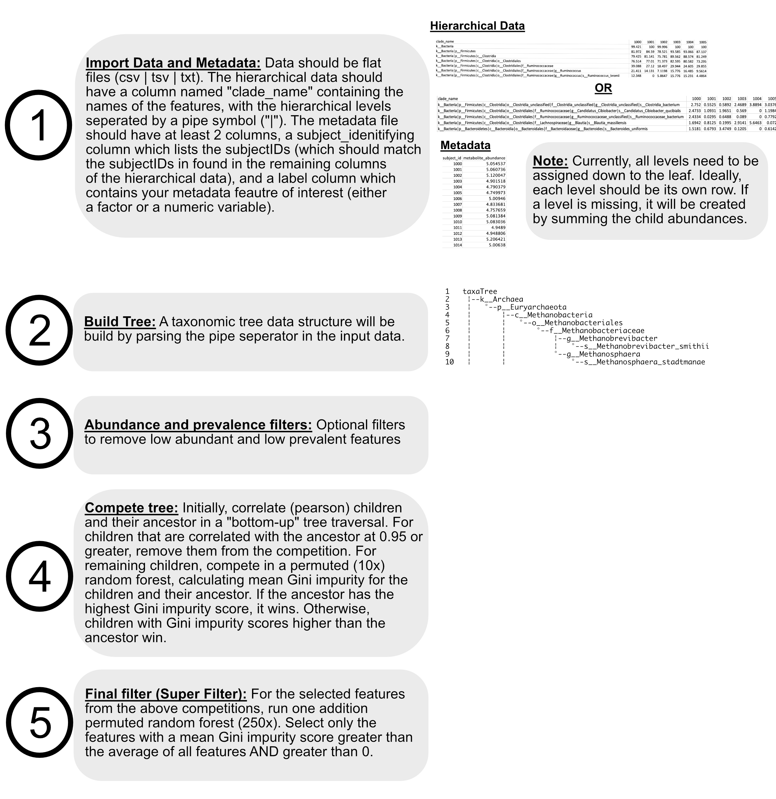

 # **TaxaHFE**
## **Version 2.0 is now available!** 
- Now using ```data.tree``` to analyze hierarchical data using a tree-traversal strategy.
- Children are allowed to compete against all ancestors as long as they keep winning hierarchical competitions.
- TaxaHFE v2 selects far less features than TaxaHFE v1, for the same or better model performance.
- TaxaHFE v2 can replicate TaxaHFE v1 by setting the flat ```--max_depth 1```

 # **taxaHFE**
 
 ## VERSION 2 RELEASE: 
 Version 2 of this algorthim makes numerous advances over Version 1. While it is reasonably stable, please report any issues! We suggest you use Version 2! 

 Change log:
- convert to using a tree-based data structure
- allow children competitions past the immediate parent (!!)
- speed and memory enhancements
- generally as good of performance (model performance) as version 1, but utilizes significantly fewer features.

-----------------------------------

 A program to perform hierarchical feature engineering on data with taxonomic organization (i.e., microbiome data, dietary data)

## **Table of Contents**
- [Description](https://github.com/aoliver44/taxaHFE#description)
- [Download taxaHFE](https://github.com/aoliver44/taxaHFE#download-taxahfe)
- [Quickstart](https://github.com/aoliver44/taxaHFE#quickstart)
- [Flag information](https://github.com/aoliver44/taxaHFE#information-about-the-flags)
- [About](https://github.com/aoliver44/taxaHFE#about)
- [Contribute](https://github.com/aoliver44/taxaHFE#contribute)


-----------------------------

 ## **Description:** 
 A program to perform hierarchical feature engineering on data with taxonomic organization (i.e., microbiome data, dietary data). TaxaHFE takes in a dataset of abundances for every hierarchical level, and then uses correlation and machine learning to determine the optimum taxonomic level which contains the most information relative to a metadata covariate of interest. This is not a new idea; however, few implementations exist in the wild. For some reading on these ideas, please follow the links below!

[TaxaHFE: A machine learning approach to collapse microbiome datasets using taxonomic structure.](https://www.biorxiv.org/content/10.1101/2023.06.06.543755v1)
Andrew Oliver & Danielle G. Lemay. 2023. *BioRxiv*. 

[Taxonomy-aware feature engineering for microbiome classification.](https://bmcbioinformatics.biomedcentral.com/articles/10.1186/s12859-018-2205-3)
Mai Oudah & Andreas Henschel. 2018. *BMC Bioinformatics*.

[Feature Selection in Hierarchical Feature Spaces.](https://link.springer.com/chapter/10.1007/978-3-319-11812-3_25)
Petar Ristoski & Heiko Paulheim. 2014. *International Conference on Discovery Science*.


-----------------------------


## **Outline of taxaHFE**




</br>

------------------------------
## **Download taxaHFE**


Option 1: The easiest way to get started is pulling the docker image. Please [install docker](https://www.docker.com/) you go this route. 

```
docker pull aoliver44/taxa_hfe:2.0
```

Option 2: Alternatively, you can pull this image using Singularity:

```
singularity pull taxaHFE.sif docker://aoliver44/taxa_hfe:2.0
```

Option 3: Finally, it's possible to build the image yourself:

1. Download the dockerfile and renv.lock file from github
2. Navigate to the directory with these files
3. Run the command:

```
docker build -t taxa_hfe:2.0 .
```
</br>

------------------------------
## **Quickstart**

Option 1: Run taxaHFE with **YOUR** data:
1. Navigate to the directory containing your data, and start the docker image!
```
docker run --rm -it -v `pwd`:/home/docker -w /home/docker aoliver44/taxa_hfe:2.0 bash

## or with singularity
singularity run -W `pwd` --bind `pwd`:/home/docker taxaHFE.sif bash
```
2. Run taxaHFE
```
taxaHFE [options] <METADATA> <DATA> <OUTPUT>
```
OR

Option 2: Run taxaHFE on **EXAMPLE** data provided:

```
## STEP 1: CLONE THE REPOSITORY
git clone https://github.com/aoliver44/taxaHFE.git && cd taxaHFE

## STEP 2: RUN THE CONTAINER
docker run --rm -it -v `pwd`:/home/docker -w /home/docker aoliver44/taxa_hfe:2.0 bash

## STEP 3: RUN TAXAHFE 
taxaHFE --subject_identifier Sample --label Category --lowest_level 3 --ncores 2 --seed 42 /home/docker/example_inputs/metadata.txt /home/docker/example_inputs/microbiome_data.txt /home/docker/example_inputs/output.csv
```

</br>

### Running taxaHFE on Windows

taxaHFE can run on Windows through [Powershell](https://aka.ms/PSWindows) and [Docker Desktop for Windows](https://docs.docker.com/desktop/install/windows-install/). In order for the program to run smoothly, several adjustments are recommended beforehand:

 1) **Prepare wsl (Windows Subsystem for Linux)**

    In Powershell, set the default wsl to Ubuntu. The default will only need to be set once, but wsl will need to be turned on with every taxaHFE run. 
    
    *Note*: Error without setting default, "VS Code Server for WSL closed unexpectedly"

```  
## Powershell       
## change default wsl to Ubuntu
wsl --set-default Ubuntu 

## turn on wsl
wsl                      
```

2) **Enable Ubuntu in Docker Desktop App**

    *Note*: Error without setting adjustment, Directory files do not read in when docker is initiated

-   Settings \> Resources \> WSL Integration \> Enable Ubuntu

</br>

------------------------------
## **Information about the flags**


```
Hierarchical feature engineering (HFE) for the reduction of features with respects to a factor or regressor
Usage:
    taxaHFE [options] <METADATA> <DATA> <OUTPUT>
    
Options:
    -h --help                         Show help text.
    -v --version                      Show version.
    -s --subject_identifier <string>  Metadata column name containing subject IDs [default: subject_id]
    -l --label <string>               Metadata column name of interest for ML [default: cluster]
    -t --feature_type <string>        Is the ML label a factor or numeric [default: factor]
    -f --sample_fraction <float>      Only let rf see a fraction of total data [default: 1]
    -a --abundance <float>            Minimum mean abundance of feature [default: 0.0001]
    -p --prevalence <float>           Minimum prevalence of feature [default: 0.01]
    -L --lowest_level <int>           Most general level allowed to compete [default: 2]
    -m --max_depth <int>              How many hierarchical levels should be allowed to compete [default: 1000]
    -c --cor_level <float>            Initial pearson correlation filter [default: 0.95]
    -n --ncores <int>                 Number of cpu cores to use [default: 2]
    -d --disable_super_filter         Disable running of the super filter (final forest competition)
    -w --write_old_files              Write individual level files and old HFE files
    -W --write_flattened_tree         Write a compressed backup of the entire competed tree
    -D --write_both_outputs           Write an output for pre and post super filter results, overridden by --disable_super_filter
    --nperm <int>                     Number of RF permutations [default: 40]
    --seed <numeric>                  Set a random numeric seed, default is to use system time

Arguments:
    METADATA path to metadata input (txt | tsv | csv)
    DATA path to input file from hierarchical data (i.e. hData data) (txt | tsv | csv)
    OUTPUT output file name (csv)
```

--subject_identifier: this is a column that identifies the sample or subject ID in the input metadata. All subjectIDs should be unique. They will be coerced to unique values (and simplified snake_case alpha-numerics) using ```janitor::make_clean_names()```

--label: the name of the column in your input metadata that you are trying to predict with HFE. Can be a factor or continuous. 

--feature_type: is the label a factor or a continuous variable (options: factor or numeric)?

--subsample: a decimal value for performing stratified subsampling of factor type data. This behavior is to help protect against data-leakage.

--abundance: a per-feature abundance filter. This filter calculates an outlier-resistant mean (trimming the top and bottom 2% of data) of the feature's abundance. If the average abundance across the middle 96% of samples is above this value, the feature is kept. Note, if your sampling effort is not standardized in some way (e.g. relative abundance), this filter may produce undesirable behavior. To turn this filter off, set its value to 0 (or the minimum value in your dataset). The default behavior is to filter out features below a mean abundance of 0.0001; however, this assumes the feature abundances exist on a scale from 0-1. 

--prevalence: a per-feature prevalence filter. This filter sets the number of non-zero occurrences desired for features. The default behavior is if the feature is 99% zeros, it will be dropped from further analysis. This filter is also somewhat sensitive to sampling depth, as samples with greater sampling depth will likely find rarer features.

--lowest_level: The lowest level for which to compete in a taxaHFE competition. To better understand this parameter, consider a microbiome competition as an example: Each feature contains some version of taxonomic levels from general -> specific (kingdom, phylum, class, order, family, genus, species). taxaHFE adds one additional level "below" kingdom, called taxa_tree (a somewhat meaningless root representing the sum-total abundance per sample). Setting ```--lowest_level 1``` allows taxaHFE to take competitions all the way to taxa_tree, potentially allowing it to be the only feature selected (if, for instance, the differences in sum-total abundances are the most informative feature with respects to your metadata label). The default behavior is to set ```--lowest_level 2```, which would stop the competitions at the kingdom level in this example. Sometimes, this behavior will result in a similar result described above (i.e., the kingdom Bacteria is selected as the sole winner). IF your interest is what features are informative within your most general grouping (i.e., which bacteria, archaea, etc.), then consider setting this value to ```--lowest_level 3```.

--max_depth: how deep should a child be allowed to compete? In version 1 of this program, max_depth was effectively 1, which meant that a child was only allowed to compete against their parent, but NOT their grandparent. The default behavior in the current version is ```--max_depth 1000```, which means a child is allowed to compete against their parent and 1000 hierarchical levels beyond their parent (i.e., great-great-great...grandparent). If they are an informative feature, they are allowed to keep competing.

--cor_level: what initial correlation threshold (Pearson) to use when comparing child to parent. We use a high threshold (0.95) and encourage this threshold to stay high. We are really after *redundant* features with this step, we're are not trying to institute a deep correlation filter.

--write_old_files: should files summarized at each taxa level be written to file? The old HFE program files are written to for use in the Oudah et al. algorithm

--ncores: number of cores to let the random forest use. Not a huge speed up, but if you have the cores available, it can't hurt.

--nperm: number of RF permutations to make to average out the Gini impurity score. More permutations may decrease run to run variability in the number of features output, but at a cost of run time.

--seed: the default behavior is to use ```Sys.time()``` to generate a random seed each time taxaHFE is run. If you set it to a number, it will likely return the same results across repeated runs (though this assumption has not been thoroughly tested).

--disable_super_filter: if provided, will not run the final competition (super filter) against all the winning features

--write_flattened_tree: if provided, will write a gzip backup of the entire flattened competed tree

--write_both_outputs: if provided, will write the pre and post final competition (super filter) output files

[METADATA]: A **full path** to the file that contains the metadata column you wish to predict with your hierarchical data. This file should contain BOTH your subject_identifier and your metadata label

[DATA]: A **full path** to the taxonomic or hierarchical feature set. Columns should be your subject_identifier, plus one column labeled clade_name. Each feature should have the levels separated using a pipe separator (```"|"```).

[OUTPUT]: A **full path** to a file which will be the main output file. The other output files will parse this path. 


**OUTPUTS**

**output_level_[1,2,3...].csv:** summarized files at each taxonomic level (if write_old_files = TRUE)

**output.txt:** taxaHFE processed dataset, with super filter

**output_nosf.txt:** taxaHFE processed dataset, without super filter

**output_old_hfe_label.txt:** Label data for use in the Oudah algorithm (if write_old_files = TRUE)

**output_old_hfe_otu.txt:** OTU data for use in the Oudah algorithm (if write_old_files = TRUE)

**output_old_hfe_taxa.txt:** Taxa data for use in the Oudah algorithm (if write_old_files = TRUE)

</br>

------------------------------
## **About**

We developed software, called TaxaHFE (Hierarchical Feature Engineering), which works by first considering the pairwise correlation structure between a taxon and its descendants to prune descendants above a correlation threshold. Next it permutes a random forest on the taxon and remaining descendants to determine how important each is at explaining an intervention or clinical covariate. If, on average, the taxon is the most important feature in the model, the descendants are dropped, otherwise only the descendants more important than the taxon are kept. Last, an optional final filter step considers all features remaining, and again permutes a random forest. Any features which are either below the average importance of all remaining features or have a negative or zero average importance are dropped.  

</br>

------------------------------
## **Contribute**

Feel free to raise an issue, contribute with a pull request, or reach out!


