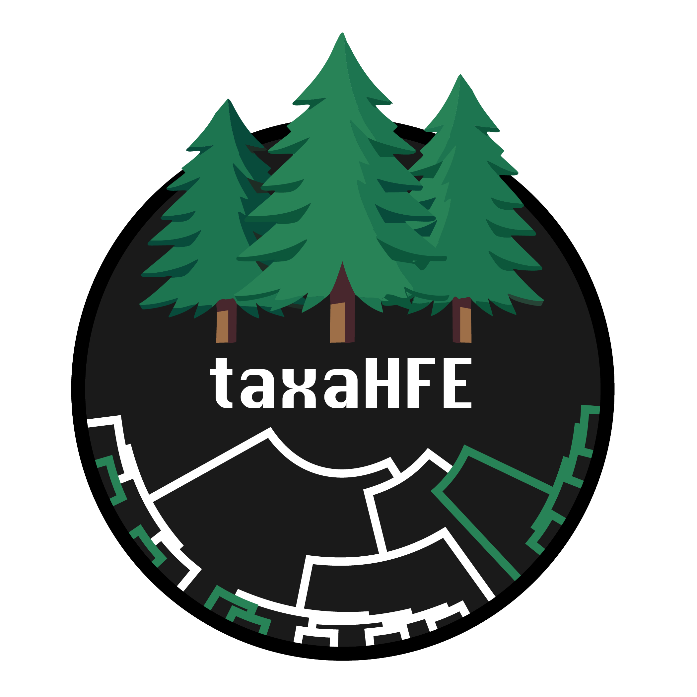

# **Development** <a></a>
<a></a>

The TaxaHFE repo provides an RStudio server image to aid in devlopment. To launch the server use the following command:

```
docker compose up -d
```

To access the server navigate to http://localhost:8787, the username and password will be `rstudio`.

*Note: This will use the remotely build `aoliver44/taxa_hfe_rstudio` by default, if a local build is required, add the `--build` flag to the `docker compose` command above.*

### Restarting/stoppinp

The server can be restarted using:
```
docker compose restart
```

The server can be stopped using:
```
docker compose down
```