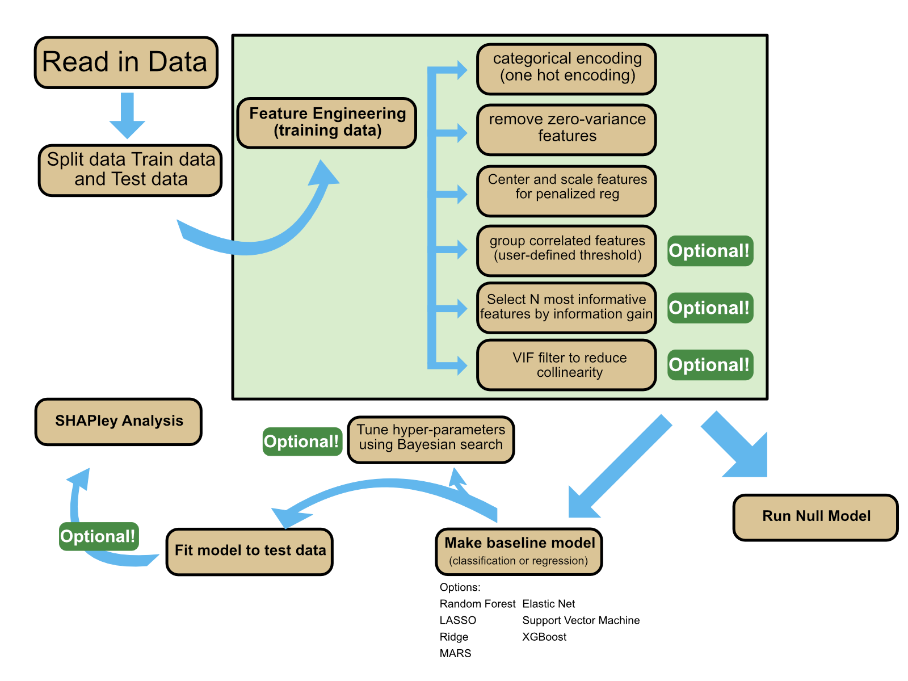
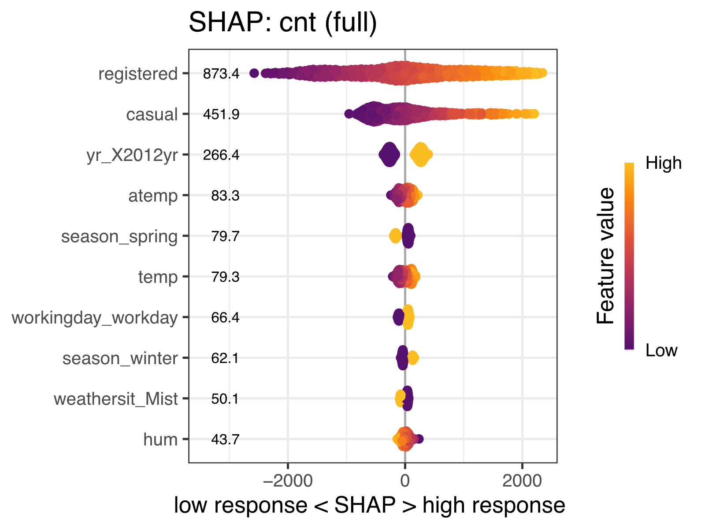

# **DietML** <a></a>

```dietML``` is a thought-out wrapper for machine learning, making use of the [Tidymodels](https://www.tidymodels.org/) package and framework in R. It will take an input set of features and perform ML using responsible defaults. However, the user is free to change the --flag values to fit their needs. 

Note, ```dietML``` is not a "specialized" solution for ML. For example, when you have few samples, nested-CV may be a more appropiate CV than stratified k-fold on the training data (the method ```dietML``` implements). ```dietML``` will also let you perform ML with inappropriately small sample sizes. Please use your best judgement!

## **Table of Contents**

- [Outline of ML pipeline](#outline-of-ml-pipeline)
- [Installing dietml](#installing-dietml)
- [Example: the mtcars dataset](#example-the-mtcars-dataset)
- [Flag information](#information-about-the-flags)
- [Troubleshooting](#troubleshooting)
- [FAQ](#faq)
- [Acknowledgments](#acknowledgments)
- [Contribute](#contribute)
- [Citation](#citation)


 ## **Outline of ML pipeline** 
```dietML``` makes use of the [Tidymodels](https://www.tidymodels.org/) framework. At a high level, it performs 6 general steps:

1. Read in data
2. Split data in training and testing data
3. Define the initial ML model (e.g., Random forest, LASSO, etc.)
4. Tune hyperparameters using k-fold cross validation inside the training split (optional)
5. Fit best model to test data
6. Identify variables of importance using Shapley values


### **Graphical outline of dietML**




## **Installing dietML**

```dietML``` is a containerized application and can be run in the following ways:

<details>
<summary> <b>Option 1:</b> The easiest way to get started is by pulling the Docker image. This is a good option if you are on your own machine and have permission to install software.
</summary>

Please [install docker](https://www.docker.com/) if you choose this route. Pulling these containers for the first time may take a few minutes to run, so please be patient. 

*Additionally, if this is your first time using Docker, you may need to configure the program to allow it to use the appropriate compute resources (i.e., ram, CPUs, etc.).*
```
## pull dietML
docker pull aoliver44/diet_ml:latest
```
</details>
</br>
<details>
<summary> <b>Option 2:</b> Alternatively, you can pull this image using Singularity or Apptainer. This is a good option if you are on a managed HPC environment.
</summary>
Note that currently running the below commands using Apptainer will still work, as Apptainer has superseded Singularity, but will still run with the old command. That may change someday, so if you run into an error, try replacing `singularity` with `apptainer`.

```
## pull dietML
singularity pull dietML.sif docker://aoliver44/diet_ml:latest
```
</details>
</br>


<details>
<summary> <i>A note on using Docker on Windows</i> </summary> 

```taxaHFE``` can run on Windows through [Powershell](https://aka.ms/PSWindows) and [Docker Desktop for Windows](https://docs.docker.com/desktop/install/windows-install/). In order for the program to run smoothly, several adjustments are recommended beforehand:

 1) **Prepare wsl (Windows Subsystem for Linux)**

    In Powershell, set the default wsl to Ubuntu. The default will only need to be set once, but wsl will need to be turned on with every ```taxaHFE``` run. 
    
    *Note*: Error without setting default, "VS Code Server for WSL closed unexpectedly"

```  
## Powershell       
## change default wsl to Ubuntu
wsl --set-default Ubuntu 

## turn on wsl
wsl                      
```

2) **Enable Ubuntu in Docker Desktop App**

    *Note*: Error without setting adjustment, Directory files do not read in when docker is initiated

-   Settings \> Resources \> WSL Integration \> Enable Ubuntu

</details>

------------------------------
## **Example: the Capital Bike dataset**

This example is included in the repository for several reasons. First, it’s a dataset we use to test ```dietML``` as we continue to develop the program and implement enhancements to improve the user experience. Second, it provides users with a reference set of files to compare their own inputs against—these files are in the correct format! Lastly, both of the developers have made ue of Captial Bike rentals (ok Matt, one more than the other).


**Step 1:** Clone the repository or download the example data files in the [example_inputs/](https://github.com/aoliver44/taxaHFE/tree/main/example_inputs) directory on GitHub

```
## clone the repository
git clone https://github.com/aoliver44/taxaHFE.git && cd taxaHFE/
```

**Step 2:**  Run ```dietML``` using the example files. This command will work with the example data. If it doesn't, check out our troubleshooting tips below (do you have Docker running?), or consider opening an issue on GitHub. 

> [!CAUTION] 
> Setting container-level resources is by far the most reliable way (in our experience) to ensure that ```taxaHFE``` uses the appropriate system resources. If you set ```--ncores 2``` without also specifying ```--cpus=2``` in the Docker command (or the equivalent flag in Apptainer), some processes within ```dietML``` may exceed the intended resource limits. </br> </br> Setting ```--ncores 1``` will instruct ```dietML``` to limit resource usage as best it can, but this is not foolproof. The main situation where excessive core usage becomes an issue is when the ```--shap``` flag is used. To avoid this, we strongly recommend setting CPU and memory limits directly in the ```docker run``` command. Adjust the values to suit the capabilities of your machine.

```
docker run --cpus=2 --memory=4g --rm -it -v `pwd`:/data aoliver44/diet_ml:latest example_inputs/bike_share_day.csv -o test_outputs -s instant -l cnt --model ridge -t numeric --metric rsq --tune_time 1 --seed 1234 --shap -n 2
```

Using the default of 2 cores on a MacBook Pro with an M3 chip, the above command took approximately 8 minutes and 21 seconds to complete. RAM usage peaked at around 1.4 GB. Increasing resources to 8 cpus (```--cups=8``` *and* ```--ncores 8```), and ```--memory=8g``` cut that runtime significantly (runtime = 3 minutes and 12 seconds). The input data included 288 samples and 1,187 MetaPhlAn-generated taxonomic features. We put in some effort to provide progress bars so you know something is happening. In some situations—especially certain computer or HPC environments—these progress bars may not show up. Bummer.

**Step 3:** Examine the outputs. Several outputs get generated from the command run in the previous step:

```
├── test_outputs
│   ├── dietml_test_1234.csv
│   ├── dietml_train_1234.csv
│   └── ml_analysis
│       ├── dummy_model_results.csv
│       ├── hyperpars_tested.pdf
│       ├── ml_results.csv
│       ├── shap_dietml_1234_full.pdf
│       ├── shap_dietml_1234_test.pdf
│       ├── shap_dietml_1234_train.pdf
│       ├── shap_inputs_dietml_1234.RData
│       └── training_performance.pdf
```

The train and test data that fed the machine learning models are written to files (dietml_test_seed.csv and dietml_train_seed.csv). The results of the machine learning model (the performance of the model on the test data, along with the perforamnce of the null model). With the ```--shap``` command run, the shap_* files are written. Probably the most important one to view is shap_dietml_1234_full.pdf, which is a beeswarm SHAP plot on the full input dataset.

For a great overview of SHAP analyses and how to interpret these plots, check out [this guide](https://www.aidancooper.co.uk/a-non-technical-guide-to-interpreting-shap-analyses/).

### Examining the results
<details>
<summary> 
1) Lets look at: ./test_outputs/ml_analysis/ml_results.csv
</summary>

| metric | estimator | estimate | config            | null_model_avg | seed | program |
|--------|-----------|----------|-------------------|----------------|------|---------|
| ccc    | standard  | 0.9931642435986459 | pre0_mod0_post0 | 0              | 1234 | dietml  |
| mae    | standard  | 160.10850142514704 | pre0_mod0_post0 | 1576.8851351351352 | 1234 | dietml  |
| rmse   | standard  | 218.52784945338402 | pre0_mod0_post0 | 1912.5710321507745 | 1234 | dietml  |
| rsq    | standard  | 0.9886360024069695 | pre0_mod0_post0 | NA             | 1234 | dietml  |


Here we see the r-squared the model is 0.988...(way too many digits). Additionally, the MAE of the trained model (160.1) is far lower than the MAE of the null model (1576.9). This suggests ```dietML``` did a pretty good job predicting bike share using the features in the example dataset. 
</details>
</br>
<details>
<summary> 
2) Lets next look at: ./test_outputs/ml_analysis/shap_dietml_1234_full.pdf
</summary>

The below figure shows the ```taxaHFE```-selected features that driving the ML model predictions:




```dietML``` will plot the top 10 most important features, determined by a SHAP analysis, using a beeswarm plot.  For example, in the above plot, note that the top feature, "registered" (Capital Bike registered users on a given day), is positively associated with number of active users on a given day.
</details>


## **Information about the flags**

### Usage:

```
## help menu for dietml
docker run --rm -it aoliver44/diet_ml:latest -h
```

Don't forget to set docker resources (```--cpus``` and ```--memory```), and to bind your data directory (```-v `pwd`:/data```) when you are ready to run the program!

</details>
<details>
<summary> <b>dietML flags:</b> 
</summary>

```
DietML arguments:
  Run regression or classification ML models on a dataframe

  -s <string>, --subject_identifier <string>
                        Metadata column name containing subject IDs (default: subject_id)
  -l <string>, --label <string>
                        Metadata column name of interest for ML (default: feature_of_interest)
  -c <numeric>, --cor_level <numeric>
                        Initial pearson correlation filter. Bypasses cor_level filter if set to 1 (default: 1)
  --info_gain_n <numeric>
                        Should information gain preprocessing be used? Set n number of features to be selected during preprocessesing. Bypasses info_gain_n if set to 0. (default: 0)
  --train_split <numeric>
                        Percentage of samples to use for training (default: 0.8)
  --model <string>      ML model to use. Options: rf, enet, lasso, ridge. (default: rf)
  --folds <numeric>     Number of CV folds for tuning (default: 10)
  --cv_repeats <numeric>
                        Number of CV repeats to perform for repeated CV (default: 3)
  --metric <string>     Metric to optimize (default: bal_accuracy)
  -t <string>, --feature_type <string>
                        Is the ML label a factor or numeric (default: factor)
  --tune_length <numeric>
                        Number of hyperparameter combinations to sample (default: 80)
  --tune_time <numeric>
                        Time for hyperparameter search (in minutes) (default: 2)
  --tune_stop <numeric>
                        Number of HP iterations without improvement before stopping (default: 10)
  --shap                Calculate SHAP values (default: False)
  -n <numeric>, --ncores <numeric>
                        Number of threads/cores to use in certain functions that can perform parallel processing. To limit overall resource usage of dietML., limit the amount of resources available to the container (e.g. --cpus=4 for Docker). Note that total resources needed are parallel_workers * ncores. (default: 2)
  --parallel_workers <numeric>
                        Number of parallel search processes to run for hyperparameter tuning in dietML. Note that total resources needed are parallel_workers * ncores (e.g. --cpus=4 for Docker) (default: 1)
```
</details>
</br>

<details>
<summary> <b>Additional details about the flags</b> 
</summary> 

Below are some some additional details about certain flags.

```--subject_identifier```: Specifies the column in the input metadata that identifies each sample or subject ID. All subject IDs should be unique. They will be coerced to unique, simplified snake_case alphanumeric values using ```janitor::make_clean_names()```.

```--cor_level```: A number between 0-1, which defines a Pearson correlation threshold at which features are combined. The underlying function can be found [here](https://recipes.tidymodels.org/reference/step_corr.html). Note that if set to 1--its defualt value--this correlation filter is entirely bypassed.

```--info_gain_n```: The number of features that should be selected during feature engineering, based on information gain. For example, if set to 5, the resulting training models will only see the top 5 features by information gain. This step is conducted at the end, meaning all other feature engineering steps come before it. Finally, if you set this too high, as in more features than are present, the program will still run. Setting the value to 0 (the default) will bypass this step entirely. You can read more about the underlying code [here](https://stevenpawley.github.io/colino/reference/step_select_infgain.html).

```--parallel_workers```: During hyperparameter tuning and the SHAPley analysis, parallel workers can be utilized. This is done using makePSOCKcluster(), which spawns new R sessions for parallel work. Note that the resources you will need will be ncores * parallel workers. Note, this may increase RAM needs.

```--ncores```: ncores are set seperately from parallel workers. These specify resources availible in functions such as reading and writing data, and the individual models themselves (e.g., for a random forest, how many cores does Ranger see?). This is distinct from how many processes are run in parallel, as definied by parallel_workers. Once again, we highly recommend you set the container resources (e.g., ```docker run --cpus=2```), to match whatever you set with ```--ncores```.

```--shap```: The presence of this flag will tell ```dietML``` to run a SHAPley analysis. Presently, only regression models, or models with a binary factor, will be able to make use of this. Otherwise the process will error out.

```--seed```: the default behavior is to generate a random seed each time ```taxaHFE``` is run, between the minimum and maximum values of machine precision for the R language (-2e31 - 2e31). If you set it to a number, it will likely return the same results across repeated runs (assuming you are on the same machine).

</details>

## Troubleshooting

**Problem #1:** I'm getting the error:
```
docker: Cannot connect to the Docker daemon at unix:///Users/.docker/run/docker.sock. Is the docker daemon running?
```

<details>
<summary> <b>Fix #1:</b> 
</summary>
Make sure the Docker application is running! If you can't run ```docker image list``` in your terminal, the Docker application has not been started!
</details>

</br>

**Problem #2:** Docker is running but I immediately get this error:

```
usage: diet_ml [options] METADATA DATA
diet_ml.R: error: unrecognized arguments:
```

<details>
<summary> <b>Fix #2:</b> 
</summary>
Double check all the flags for spelling issues! For example, if you specified ```-seed``` instead of ```--seed``` (note number of dashes!), the program will error.
</details>

</br>

**Problem #3:** I get a terminal message like this:

```
Error in `check_time()`:
! The time limit of 0.2 minutes has been reached.
Backtrace:
     x
  1. +-global run_diet_ml(...)
  2. | \-global pass_to_dietML(...)
  3. |   \-global run_dietML_ranger(...)
  4. |     \-diet_ml_wflow %>% ...
  5. +-tune::tune_bayes(...)
  6. \-tune:::tune_bayes.workflow(...)
  7.   \-tune:::tune_bayes_workflow(...)
  8.     \-(function() {...
  9.       \-tune::check_time(start_time, control$time_limit)
 10.         \-rlang::abort(paste("The time limit of", limit, "minutes has been reached."))
x Optimization stopped prematurely; returning current results.
```
or
```
! No improvement for 10 iterations; returning current results.
```
<details>
<summary> <b>Fix #3:</b> 
</summary>

No fix needed! These are just messages from the ```tidymodels``` package informing you on the hyperparameter tuning steps.

</details>

</br>

**Problem #4:** After building and competing the tree, I get the error: 

```
Error in `check_outcome()`:
! For a classification model, the outcome should be a `factor`, not a `numeric`.
```
<details>
<summary> <b>Fix #4:</b> 
</summary>
If your outcome factor is encoded as 0 and 1 the downstream ML will break. Please encode it as "high" or "low" for example.
</details>

</br>

**Problem #5:** I see this message when running SHAP analysis

```
SHAP analysis encountered an issue and all output files may not have been generated
```

<details>
<summary> <b>Fix #6:</b> 
</summary>
Occasionally SHAP errors out, expecially when sample sizes are limited. Because we initially write the full SHAP file first (PDF contains `_full`), which is the SHAP analysis run using all of the samples, check first to see if the full SHAP PDF has been generated. If so, this is the relevant data. We attempt to generate SHAP analyses on the test and training data as well, and they might be missing.

Additionally, the SHAP analysis only supports a binary factor (2 levels), or a continous numeric. Make sure this is true for your data.

</details>

## **FAQ**

## **Acknowledgments**

Special thanks to Stephanie M.G. Wilson for the logo.
</br>

## **Contribute**

Feel free to raise an issue, contribute with a pull request, or reach out!

------------------------------
## **Citation**

In progress...